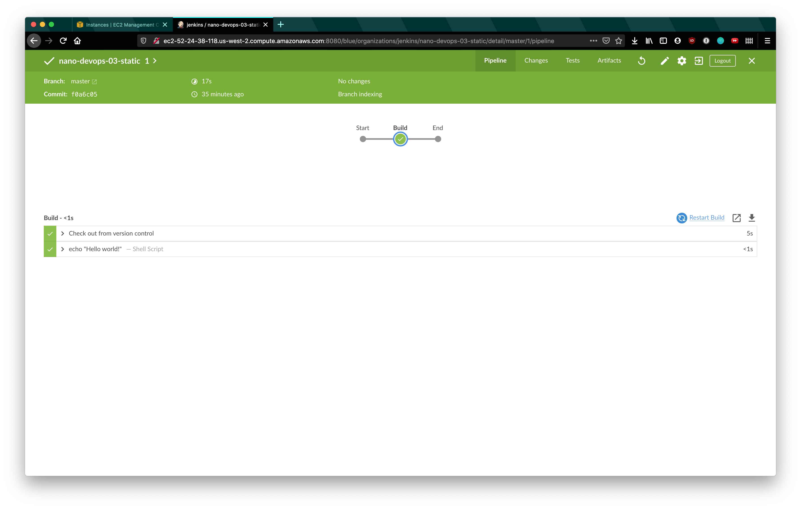

# nano-devops-03

Project 3 of the Udacity Nanodegree:

Create and run an instance on AWS, configure Jenkins, and create a pipeline to deploy a static website on S3.

Project files in [this repository](https://github.com/maweeks/nano-devops-03-static).

## Steps

- Create IAM user

- Create a new EC2 instance

- Install Jenkins

- Install Blue Ocean

- Create build to add to jenkins

- Auto upload website to S3

- Add html linting and make it fail

- Make html linting pass

